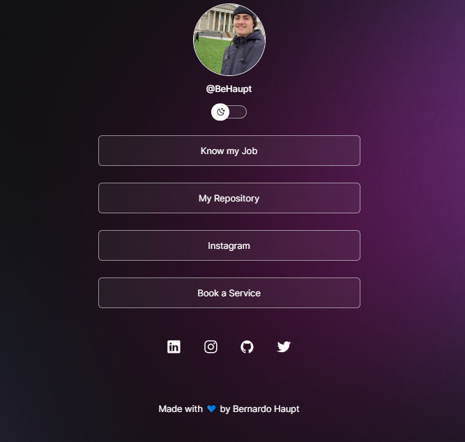

<h1 align="center"> DevLinks </h1>

  <a href="#-technologies">Technologies</a>&nbsp;&nbsp;&nbsp;|&nbsp;&nbsp;&nbsp;
  <a href="#-project">Project</a>&nbsp;&nbsp;&nbsp;|&nbsp;&nbsp;&nbsp;
  <a href="#memo-license">License</a>

  

 

  

## 🚀 Technologies

That project was developed with the following technologies:

- HTML e CSS
- JavaScript
- Git e Github
- Figma

## 💻 Project

The DevLinks is a link aggregator to use as an online business card.

- [Access the project, online](https://behaupt.github.io/DevLinks/)

## 🔖 License

This project is under the MIT license.

---
